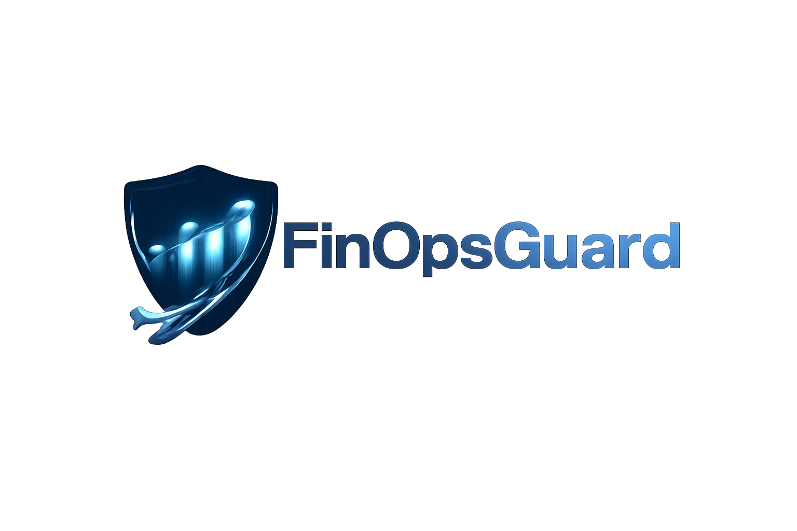
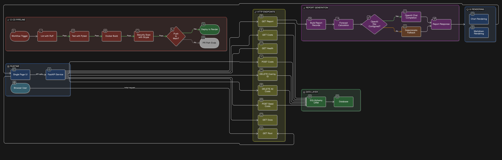

<p align="center">
  
</p>
<p align="center">
  
  
  
  <br/>
  
  
  
  <br/>
  
  
  
  
</p>

## FinOpsGuard

**FinOpsGuard** is a cloud cost simulation, forcasting, and report generation tool, built to provide engineering and FinOps teams insight into future service rollouts, all ***before*** deployment.

## Why FinOpsGuard?
Cloud and FinOps teams typically switch between services such as **AWS Cost Explorer + Budgets, Compute Optimizer, CloudWatch, and spreadsheets**, most of which are built primarily for **live data** and produce separate reports. 

As a result:
- Teams are forced into **constant context** switching across services to **manually** interpret data and identify inefficiencies in compute utilization, spending patterns, and more.
- If teams want insight into the impact of a future cloud service rollout, they **cannot input mock projected expenditure** (based on expected service cost), **generate a short-term forecast** (*lacks the mandatory 30 day billing data*), or receive **recommendations and actionable optimization** guidance tailored to that future spend profile.

Due to this existing feature gap, teams often resort to guesswork or manual estimation, which can lead to unexpected expenditure, budget breaches, and avoidable testing spend. <br> **What if there was a way to gain clarity before deployment?**

### FinOpsGuard replaces that sprawl with a single unified report featuring: 
- `Budget-to-threshold` utilization models
- Short-term forecast powered by the `Holt's Damped Trend Method`
- AI-powered recommendations and analysis from `OpenAI's gpt-5.4-mini model`

***Run reliable what-if scenarios through one workflow, detect budget risks earlier, and move from visibility to decision-ready optimization faster.***

## Capabilities

- **REST API** — FastAPI with validated request/response models and automatic OpenAPI docs. Core endpoints: `/health`, `/costs` (CRUD), `/costs/seed`, `/report`.

- **Schema Validation** — Strict Pydantic v2 contracts (`extra="forbid"`, `Field()` validators) enforce month format (`YYYY-MM`), non-negative spend, positive budgets, and monthly-only allocation periods (`Monthly`).

- **Holt's Damped Trend Forecasting** — `/report` computes a 3-month forecast server-side using double exponential smoothing with a damping factor. A smoothed level and smoothed trend are updated on each observation; the damping factor (`φ`) decelerates projected growth across successive steps, producing a realistic curve rather than a straight-line extrapolation.

- **LLM Analysis** — `/report` compiles cost history and requests observations alongside recommendations from OpenAI's `gpt-5.4-mini` model. When `OPENAI_API_KEY` is not set, a deterministic fallback is presented.

- **Interactive UX** — Landing page with two flows: a Demo Agent terminal-style walkthrough and a Try-It-Yourself data entry form with validation, sample autofill, and rendered report output. This UX was built with the assistance of modern tools.

- **Persistence** — SQLAlchemy ORM over SQLite. Environment-driven `DATABASE_URL` enables migration to a managed database without code changes.

- **Containerization** — Containerized application with Multi-stage Dockerfile as non-root user and pinned base image.

- **CI/CD** — GitHub Actions pipeline: Ruff lint → Pytest with coverage ≥ 70% → Docker build + Grype vulnerability scan → Render deploy.

- **Deployment** — Containerized  and deployed to Render with automatic deploys from GitHub.

## Architecture

### System Diagram


### Technology Stack

| Layer | Technology |
|-------|------------|
| Backend | FastAPI 0.135.1 (Python 3.12) |
| Validation | Pydantic v2 |
| Persistence | SQLite + SQLAlchemy 2.0 ORM |
| Forecasting Algorithm | Holt's Damped Trend — double exponential smoothing (server-side, zero dependencies) |
| AI Analysis | OpenAI model (`gpt-5.4-mini`) with deterministic fallback |
| Frontend | HTML/CSS/JS, Chart.js, Marked.js |
| Containerization | Docker (multi-stage, non-root) |
| CI/CD | GitHub Actions (Ruff, Pytest, Grype) |
| Deployment | Render |

### API Endpoints

| Method | Endpoint | Description |
|--------|----------|-------------|
| `GET` | `/health` | Service health status and version |
| `GET` | `/costs` | List all cost records with budget utilization |
| `POST` | `/costs` | Create a new cost record |
| `DELETE` | `/costs/{cost_id}` | Delete a single cost record |
| `DELETE` | `/costs` | Clear all cost records |
| `POST` | `/costs/seed` | Seed randomized demo data |
| `GET` | `/report` | Generate report with LLM analysis |

## Design Decisions

- **Contract-first validation** — All Pydantic models enforce `extra='forbid'` to reject unexpected fields, and `Field()` validators enforce month format, non-negative spend, positive budgets, and constrained allocation periods.

- **Separated API and persistence models** — Pydantic defines the public contract; SQLAlchemy handles storage. Swapping databases requires only changing `DATABASE_URL`.

- **SQLite for current phase** — Supports local-first development, rapid iteration, and zero operational overhead. The ORM abstraction makes migration to PostgreSQL or RDS seamless.

- **Holt's Damped Trend forecast owned by the backend** — Forecast logic lives exclusively in `ForecastEngine` in `main.py` and is returned as a typed `forecast` field on the `/report` response. The frontend only visualizes the data — no forecast computation in JavaScript. This keeps the algorithm in one auditable place and makes it easy to swap or tune.

- **LLM with graceful fallback** — `/report` calls OpenAI's API for `gpt-5.4-mini` for analysis and recommendations. If no API key is configured at runtime or the call fails, deterministic in-app analysis ensures the product still works in local and CI environments.

- **Docker containerization** — Ensures consistent runtime behavior across development, CI, and production. Multi-stage build with non-root user follows best practices.

- **Deployment pivot: AWS to Render** — The project direction was intentionally shifted from AWS deployment to Render deployment to reduce infrastructure overhead and control budget utilization while continuing to ship quickly. The app remains fully containerized and environment-driven, preserving a clean path back to AWS when needed.

- **Pinned dependencies** — Exact version pinning in `requirements.txt` ensures reproducibility across local development, CI/CD, and container builds.

## Deployment Pivot and AWS Transition Plan

FinOpsGuard is currently deployed on Render to keep operating cost lower and release iteration faster after AWS budget utilization constraints. If migrating back to AWS, the recommended target architecture is EKS for API/runtime workloads and Lambda for event-driven workloads.

### Current deployment posture

- **Active runtime** — Render deployment triggered from GitHub.
- **Why this path now** — Lower infrastructure complexity and faster release iteration.
- **AWS readiness preserved** — Containerization and env-driven config keep migration straightforward.

### AWS target architecture (high level)

1. VPC across at least two Availability Zones with public and private subnets.
2. Public ALB for ingress, routing to EKS services/pods in private subnets.
3. Horizontal scaling at both pod level (HPA) and node level (Cluster Autoscaler or Karpenter).
4. EKS for long-lived API/runtime workloads, Lambda for bursty asynchronous or event-driven tasks.

## Prerequisites

- Python 3.12+
- pip
- Git
- Docker (optional, for containerized runs)

## Environment Variables

| Variable | Required | Description |
|----------|----------|-------------|
| `DATABASE_URL` | Optional | SQLAlchemy connection string override. If unset, the app defaults to SQLite (`sqlite:///./finopsguard.db`). |
| `OPENAI_API_KEY` | Optional | Enables LLM-powered analysis in `/report`. |
| `OPENAI_MODEL` | Optional | OpenAI model override. Defaults to `gpt-5.4-mini`. |

### SQLite DATABASE_URL example (optional override)

```bash
export DATABASE_URL="sqlite:///./finopsguard.db"
```

## Quick Start

```bash
git clone https://github.com/shafayet7546/finopsguard.git
cd finopsguard

python -m venv venv

# Linux / macOS
source venv/bin/activate

# Windows (PowerShell)
.\venv\Scripts\Activate.ps1

# If script execution is blocked (run once per session)
# Set-ExecutionPolicy -Scope Process -ExecutionPolicy RemoteSigned

pip install -r requirements.txt

# Optional — enables live LLM analysis
# Linux / macOS:  export OPENAI_API_KEY="your_key"
# Windows:        $env:OPENAI_API_KEY="your_key"

uvicorn app.main:app --reload
```

Open **http://localhost:8000/docs** for the Swagger UI.

If DATABASE_URL is not set, the app uses local SQLite automatically.

## Quick Start with Docker

```bash
# Build
git clone https://github.com/shafayet7546/finopsguard.git
cd finopsguard
docker build -t finopsguard .

# Run (fallback analysis mode - no OpenAI key)
docker run -p 8000:8000 finopsguard

# Run (LLM analysis enabled)
docker run -p 8000:8000 -e OPENAI_API_KEY=your_key finopsguard
```

Open **http://localhost:8000/docs** for the Swagger UI.

## Quality Gates

```bash
# Lint
ruff check .

# Format
ruff format .

# Tests with coverage
pytest --cov=app --cov-report=term-missing --cov-fail-under=70
```

## CI/CD

The GitHub Actions pipeline in .github/workflows/ci.yml executes:

1. Ruff lint and format checks.
2. Pytest with coverage threshold enforcement.
3. Docker image build.
4. Grype vulnerability scan.
5. Render deployment trigger (main branch pushes only).

## License

This project is licensed under the MIT License. See LICENSE for details.