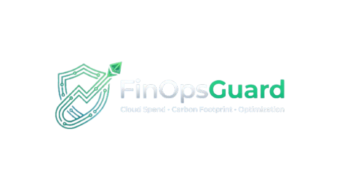

<p align="center">
  
</p>

<p align="center">
  <!-- Languages / Framework -->
  
  
  <br/>
  <!-- Cloud / Infrastructure -->
  
  
  
  
  <br/>
  <!-- DevOps / Observability / Testing -->
  
  
  
  
  
</p>

## FinOpsGuard

**FinOpsGuard** is a cloud-native AWS FinOps platform that unifies cost monitoring, carbon-impact estimation, and proactive budget governance to help organizations reduce cloud waste, strengthen financial accountability, and enable more automated, sustainability-aware cloud operations at scale.

## Why FinOpsGuard?

Cloud cost monitoring, budget governance, and sustainability insights are often fragmented across separate tools and workflows, limiting timely visibility into inefficiencies and making optimization more reactive than strategic. FinOpsGuard was built to address this gap by consolidating these signals into a unified operational workflow.


## Implemented Capabilities

- **Cloud-native Project Foundation**: Repository is structured to support planned future infrastructure automation (Terraform), containerization (Docker/Kubernetes), CI/CD, testing, and observability.

- **API**: Developed FastAPI REST API with validated request/response models and automatic OpenAPI documentation. Core endpoints (`/health`, `/costs`, `/carbon`, `/report`) are defined with structured schemas.

- **Schema Validation**: Enforced Strict data contracts enforced using Pydantic models for rejecting unexpected fields and maintaining consistent API behavior(`extra="forbid"`).

- **Persistence Layer (SQLite)**: SQLite database with SQLAlchemy ORM for persistent storage. Core endpoints (`/costs` and `/carbon`) now query the database and return strcutured, validated responses using Pydantic models.

- **Infrastructure as Code (Terraform)**: Provisioned AWS infrastructure using Terraform, including a VPC for network isolation, an S3 bucket for report storage, and an IAM role for secure service access. Structured the configuration into dedicated files for provisioning, variables, outputs, and core resource definitions (main.tf) to improve maintainability and separation of concerns.

- **Containerization (Docker)**: Containerized the application using Docker to ensure consistent runtime environments across both development and deployment. The Dockerfile defines all the environment configurations, dependencies, and application startup through Uvicorn.

## Roadmap
- AWS cost ingestion and carbon estimation logic
- PDF report generation and S3 storage
- Docker + Kubernetes (EKS) deployment
- GitHub Actions CI/CD pipeline
- Observability (Prometheus + Grafana)
- Security scanning (Trivy) (**planned, but subject to change**)


## Architecture and Technology

### Current Implementation

| Layer | Technology |
|------|------------|
| Backend | FastAPI (Python) |
| Validation | Pydantic v2 |
| Persistence | SQLite + SQLAlchemy ORM |
| Infrastructure  | Terraform |
| Containerization  | Docker |

### Target Platform

| Layer | Technology |
|------|------------|
| Orchestration  | Kubernetes (EKS) |
| CI/CD  | GitHub Actions |
| Observability  | Prometheus, Grafana |
| Security  | Trivy |

---  
## Design Principles & Engineering Decisions  

### Principles
- **Automation-oriented operations**  
Repetitive monitoring, reporting, and governance workflows should be designed for automation to reduce manual overhead, improve consistency, and support operational scaling.

- **Unified visibility**  
Cost, Budget, and Carbon signals should be accessible in one operational workflow.

- **Proactive decision-making**  
Teams should be alerted in advance to inefficiencies and budget threshold hits before they do become larger operational problems.

- **Actionable outputs**  
Insights should translate into recommendations that support cost-efficient, and sustainability-aware infrastructure decisions over time.

- **Cloud-native extensibility**:  
The platform should be designed to evolve toward containerized, observable, and automated deployment patterns.

### Decisions

- **Strict Pydantic validation on all response models (Contract-first approach)**  
 All models enforce `extra='forbid'` to reject unexpected fields. `Field()` validators are used to enforce rules including non-negative values (`ge=0`), percentage ranges (`le=100`), minimum lengths, and semantic version patterns. 

- **Separation of concerns between API and database models**  
Pydantic models define the public API contract, while SQLAlchemy ORM models handle persistence concerns. This separation improves maintainability and makes future migration to managed databases such as Amazon RDS, seamless.

- **SQLite with SQLAlchemy ORM for persistence**  
SQLite was selected for the current phase to support local-first development, rapid iteration, and low operational overhead. Planned integration of AWS storage solutions.

- **Infrastructure as Code using Terraform**  
AWS resources were provisioned entirely using Terraform to ensure consistent, repeatable infrastructure deployment. The configuration is organized into separate files

- **Containerization using Docker**  
The application is containerized to ensure consistent runtime behavior across varying development and deployment environments. Docker encapsulates dependencies, isolates the application environment, and simplifies execution. This also enables easier future integration with CI/CD pipelines and orchestration platforms.

- **Pinned dependencies in requirements.txt**  
Exact dependency pinning ensures reproducibility across local development, CI/CD pipelines, and future container deployments.

## Prerequisites

- Python 3.10+
- pip
- Git
- Terraform
- Docker

## Environment

Development note: Primary development was performed on **Linux**, as project is intended to align with cloud-native workflows. 
> Disclaimer: The application can be also be ran on Windows systems. Please follow the appropriate virtual environment activation command below:


## Quick Start
```bash
git clone https://github.com/shafayet7546/finopsguard.git
cd finopsguard

python -m venv venv

# Linux | macOS
source venv/bin/activate

# Windows (Powershell as Administrator)
venv\Scripts\activate

pip install -r requirements.txt
uvicorn app.main:app --reload
```
#### Access Swagger UI (default port): http://localhost:8000/docs
#### Alternative Format: http://localhost:(port)/docs

### Quick Start with Docker

#### 1. Install Docker

**Linux (Ubuntu/Debian):**
```bash
sudo apt update
sudo apt install docker.io
sudo systemctl start docker
sudo systemctl enable docker
sudo usermod -aG docker $USER
# Logout and login again to apply group changes
```

**Windows:**
Download and install Docker Desktop from [https://www.docker.com/products/docker-desktop](https://www.docker.com/products/docker-desktop). Ensure WSL 2 is enabled if using Windows Subsystem for Linux.

**macOS:**
Download and install Docker Desktop from [https://www.docker.com/products/docker-desktop](https://www.docker.com/products/docker-desktop).

#### 2. Verify Installation
```bash
docker --version
```

#### 3. Clone and Build
```bash
git clone https://github.com/shafayet7546/finopsguard.git
cd finopsguard
docker build -t finopsguard .
```

#### 4. Run the Application
```bash
docker run -p 8000:8000 finopsguard
```

#### Swagger UI: http://localhost:8000/docs

---

### API Endpoints

| Method | Endpoint | Purpose | Current Status |
|--------|----------|---------|----------------|
| GET | /health | Service health check | Static response |
| GET | /costs | Returns Monthly cloud cost metrics | Backed by SQLite |
| GET | /carbon | Returns Infrastructure Carbon-impact Assessment | Backed by SQLite |
| GET | /report | Returns generated PDF summary report: Cost, Carbon, and Optimization metrics. | Placeholder response |


## Repository Structure
```
finopsguard/
├── app/
│   ├── main.py           # FastAPI entry point and route definitions
│   ├── models.py         # Pydantic v2 response models
│   ├── database.py       # SQLite connection and session management
│   └── db_models.py      # SQLAlchemy ORM models (Cost, Carbon)
├── terraform/            # IaC — VPC, S3, IAM (EKS/RDS planned)
│   ├── .terraform.lock.hcl
|   ├── main.tf        
│   ├── outputs.tf         
│   ├── providers.tf       
│   └── variables.tf 
├── k8s/                  # (planned) Helm charts + ArgoCD manifests
├── lambda/               # (planned) AWS Lambda functions for cost/carbon processing
├── tests/                # (planned) Pytest unit + Playwright E2E
├── .github/
│   └── workflows/        # (planned) GitHub Actions CI/CD pipeline
├── docs/                 # (planned) Architecture diagrams + cost reports
├── .gitignore            # Prevents commit of local, sensitive, and build artifacts
├── .dockerignore         # Excludes unnecessary files from Docker build 
├── Dockerfile            # Defines application's container image for consistent runtime envs
├── requirements.txt
└── README.md
```

---